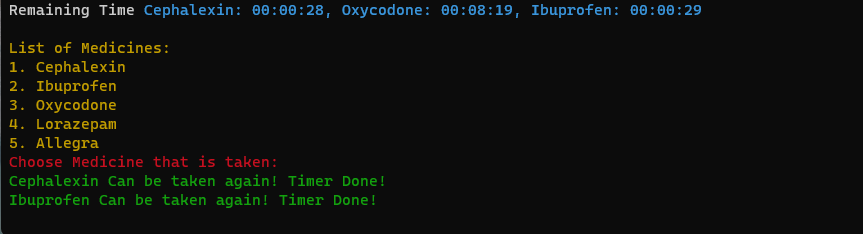

# Async stateful timer

uses tokio shared state mutex model to create a timer that keeps track of the prescription time taken.

# Disclaimer

An unnecessarily over-engineered example to test some features of rust.